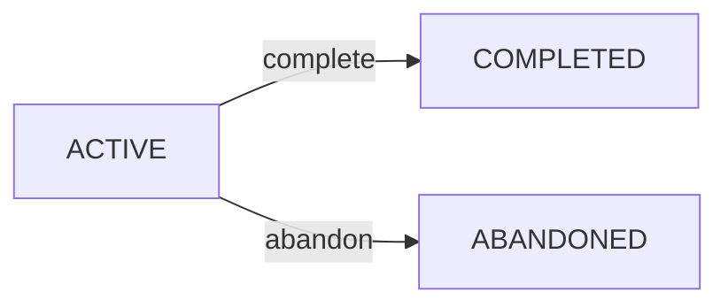

A user challenge is created when a user accepts a [challenge template](/api/challenges/templates). It tracks the user's progress through the challenge, including the current status, start date, completion date, and any diary notes.

## TypeScript interface

```typescript
export interface UserChallenge {
  id: number;
  user_id: string;
  template_id: number;
  status: 'ACTIVE' | 'COMPLETED' | 'ABANDONED';
  start_date: string;          // ISO 8601
  completed_at: string | null; // ISO 8601, null until resolved
  notes?: string | null;       // Optional diary notes
  created_at: string;          // ISO 8601
  updated_at: string;          // ISO 8601
  template?: ChallengeTemplate; // Populated when fetching details
}
```

## Status lifecycle



When a user accepts a template, the challenge starts in `ACTIVE` status. From there it can only transition to either `COMPLETED` (via the complete endpoint) or `ABANDONED` (via the abandon endpoint). Neither transition is reversible.

<Warning>
  Only one challenge can be `ACTIVE` at a time. Attempting to accept a new template while another challenge is active will return an error. The user must complete or abandon the current challenge first.
</Warning>

---

## Accept a challenge

`POST /user-challenges/accept`

Accepts a challenge template and creates a new user challenge with `ACTIVE` status.

### Request body

<ParamField body="templateId" type="number" required>
  The ID of the challenge template to accept.
</ParamField>

### Response

Returns the newly created `UserChallenge` object.

### Code example

```typescript
import { challengeService } from '../../services/challenge.service';

const challenge = await challengeService.acceptChallenge(templateId);
// challenge.status === 'ACTIVE'
```

---

## Get active challenge

`GET /user-challenges/active`

Retrieves the currently active challenge for the authenticated user.

### Response

Returns the active `UserChallenge`, or `null` if no challenge is currently active.

### Code example

```typescript
import { challengeService } from '../../services/challenge.service';

const active = await challengeService.getActiveChallenge();
// active: UserChallenge | null
```

---

## List all my challenges

`GET /user-challenges`

Returns the complete challenge history for the authenticated user, including active, completed, and abandoned challenges.

### Response

Returns an array of `UserChallenge` objects.

### Code example

```typescript
import { challengeService } from '../../services/challenge.service';

const challenges = await challengeService.listMyChallenges();
// challenges: UserChallenge[]
```

---

## Complete a challenge

`PUT /user-challenges/:id/complete`

Marks an active challenge as completed. Transitions status from `ACTIVE` to `COMPLETED` and sets `completed_at` to the current timestamp.

### Path parameters

<ParamField path="id" type="number" required>
  The numeric ID of the user challenge to complete.
</ParamField>

### Response

<ResponseField name="message" type="string" required>
  Confirmation message from the server.
</ResponseField>

<ResponseField name="challenge" type="object" required>
  The updated `UserChallenge` with `status: 'COMPLETED'`.
</ResponseField>

### Code example

```typescript
import { challengeService } from '../../services/challenge.service';

const { message, challenge } = await challengeService.completeChallenge(challengeId);
// challenge.status === 'COMPLETED'
// challenge.completed_at — ISO 8601 timestamp
```

---

## Abandon a challenge

`PUT /user-challenges/:id/abandon`

Marks an active challenge as abandoned. Transitions status from `ACTIVE` to `ABANDONED`.

### Path parameters

<ParamField path="id" type="number" required>
  The numeric ID of the user challenge to abandon.
</ParamField>

### Response

<ResponseField name="message" type="string" required>
  Confirmation message from the server.
</ResponseField>

<ResponseField name="challenge" type="object" required>
  The updated `UserChallenge` with `status: 'ABANDONED'`.
</ResponseField>

### Code example

```typescript
import { challengeService } from '../../services/challenge.service';

const { message, challenge } = await challengeService.abandonChallenge(challengeId);
// challenge.status === 'ABANDONED'
```

---

## Update diary notes

`PUT /user-challenges/:id/notes`

Replaces the diary notes for a challenge. Notes can be updated at any point regardless of challenge status.

### Path parameters

<ParamField path="id" type="number" required>
  The numeric ID of the user challenge.
</ParamField>

### Request body

<ParamField body="notes" type="string" required>
  The serialised notes content. In practice the app stores notes as a JSON-serialised array of `DailyLog` entries (see below). Pass an empty string to clear existing notes.
</ParamField>

### DailyLog structure

The `notes` field on a `UserChallenge` is stored as a JSON string. When parsed, it is an array of log entries:

```typescript
interface DailyLog {
  id: string;   // crypto.randomUUID()
  date: string; // ISO 8601 timestamp
  text: string; // The user's diary entry (max 500 chars)
}
```

New entries are prepended (newest first) so the diary displays in reverse-chronological order.

### Response

Returns the updated `UserChallenge` object.

### Code example

```typescript
import { challengeService } from '../../services/challenge.service';

// DailyLog: { id: string, date: string, text: string }
const existingLogs = challenge.notes ? JSON.parse(challenge.notes) : [];

const newLog = {
  id: crypto.randomUUID(),
  date: new Date().toISOString(),
  text: 'Day 5 — feeling great, kept up the habit!',
};

// Prepend new entry (newest first) and serialise
const updatedLogs = [newLog, ...existingLogs];
const updated = await challengeService.updateNotes(
  challengeId,
  JSON.stringify(updatedLogs)
);
// updated.notes — JSON string containing the updated log array
```
