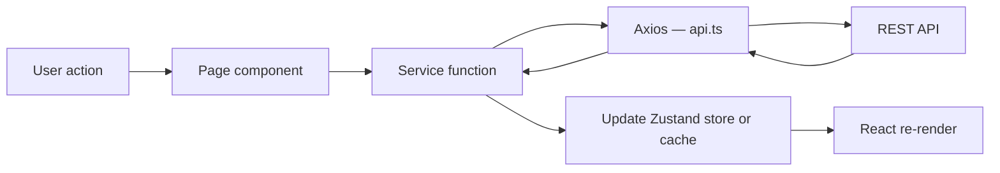

Mais Hábito is a single-page application with a clear separation between routing, pages, shared components, data-fetching services, and global state. The sections below describe how each layer fits together.

## Folder structure

```
src/
├── components/          # Shared UI: ErrorBoundary, PrivateLayout, Sidebar, BottomNav
├── pages/
│   ├── auth/            # LoginPage, SignupPage
│   ├── home/            # HomePage (landing / public)
│   ├── dashboard/       # DashboardPage
│   ├── challenges/      # ChallengesPage + modals (ActiveChallengeCard, CreateChallengeModal, etc.)
│   ├── tasks/           # TasksPage + TaskItem, CreateTaskModal, EditTaskModal, DeleteTaskModal
│   └── profile/         # ProfilePage
├── services/
│   ├── api.ts           # Axios instance with JWT interceptors
│   ├── auth.service.ts
│   ├── challenge.service.ts
│   ├── task.service.ts
│   └── user.service.ts
├── store/
│   ├── authStore.ts     # Auth state + localStorage persistence
│   ├── themeStore.ts    # Dark/light toggle
│   └── appCache.ts      # In-memory API response cache
├── styles/
│   ├── theme.ts         # darkTheme and lightTheme token objects
│   └── GlobalStyle.ts   # Global CSS reset via Styled Components
├── types/               # TypeScript DTOs and styled.d.ts augmentation
├── routes/
│   └── AppRoutes.tsx    # Route definitions, PrivateRoute, PublicRoute
├── main.tsx             # App entry — ThemeProvider, Toaster
└── App.tsx              # BrowserRouter + ErrorBoundary
```

## Layer responsibilities

<CardGroup cols={2}>
  <Card title="components/" icon="puzzle-piece">
    Shared UI elements reused across pages. Includes the `PrivateLayout`, collapsible `Sidebar`, and `BottomNav` for mobile.
  </Card>
  <Card title="pages/" icon="file">
    Route-level screen components. Each page owns its modals and sub-components. Pages call service functions — they do not use Axios directly.
  </Card>
  <Card title="services/" icon="server">
    REST communication layer. Each `*.service.ts` file wraps a specific API resource using the shared Axios instance from `api.ts`.
  </Card>
  <Card title="store/" icon="database">
    Zustand hooks for global state: authentication (`authStore`), dark/light theme (`themeStore`), and in-memory cache (`appCache`).
  </Card>
  <Card title="styles/" icon="palette">
    `theme.ts` exports `darkTheme` and `lightTheme` token objects. `GlobalStyle.ts` applies base resets and body styles via Styled Components.
  </Card>
  <Card title="types/" icon="code">
    TypeScript DTOs and interface declarations, including `styled.d.ts` which augments `DefaultTheme` with the Styled Components type system.
  </Card>
</CardGroup>

## Component design

Mais Hábito follows an atomic-ish design approach:

- **Pages** are the primary unit of composition. A page renders its own heading, modals, and feature-specific sub-components.
- **Shared components** (`components/`) only contain elements used across two or more pages — currently the layout shell.
- **Styles** live alongside their component (e.g., `Sidebar.tsx` + `Sidebar.styles.ts`) rather than in a global CSS file.

This keeps feature logic co-located and avoids importing shared state into generic components.

## Service layer

Pages never import Axios directly. All network calls go through a service file:

```typescript
// Correct — call a service function
import { taskService } from '../../services/task.service';

const data = await taskService.listMyTasks();

// Incorrect — do not call api directly from a page
import api from '../../services/api';
const data = await api.get('/tasks/me');
```

The shared `api.ts` Axios instance adds the `Authorization: Bearer <token>` header automatically on every request and handles 401 responses by clearing credentials and redirecting to `/`.

## Route guard system

Two thin wrapper components in `AppRoutes.tsx` protect routes based on authentication state from `useAuthStore`.

| Component | Behaviour |
|---|---|
| `PrivateRoute` | Renders its children if authenticated; redirects to `/` otherwise |
| `PublicRoute` | Renders its children if not authenticated; redirects to `/dashboard` otherwise |

All authenticated pages are nested under a single `PrivateRoute` that also renders `PrivateLayout` (sidebar + bottom nav). Public pages (`/`, `/login`, `/signup`) are each individually wrapped in `PublicRoute`.

## Available routes

| Path | Guard | Page |
|---|---|---|
| `/` | `PublicRoute` | `HomePage` |
| `/login` | `PublicRoute` | `LoginPage` |
| `/signup` | `PublicRoute` | `SignupPage` |
| `/dashboard` | `PrivateRoute` | `DashboardPage` |
| `/challenges` | `PrivateRoute` | `ChallengesPage` |
| `/tasks` | `PrivateRoute` | `TasksPage` |
| `/profile` | `PrivateRoute` | `ProfilePage` |

## Data flow

The following diagram shows how data moves from a user interaction to a re-render:



<Steps>
  <Step title="User action">
    The user clicks a button or submits a form inside a page component.
  </Step>
  <Step title="Service call">
    The page calls a service function (e.g., `completeTask(id)`). The service function uses the shared Axios instance from `api.ts`.
  </Step>
  <Step title="HTTP request">
    Axios sends the request with the JWT `Authorization` header injected by the request interceptor.
  </Step>
  <Step title="Response handling">
    On success, the service returns the data to the page. The page calls the appropriate Zustand setter (e.g., `setTasks`, `setDashboard`) to update cached state.
  </Step>
  <Step title="Re-render">
    Components subscribed to the updated store slice re-render with the new data.
  </Step>
</Steps>
